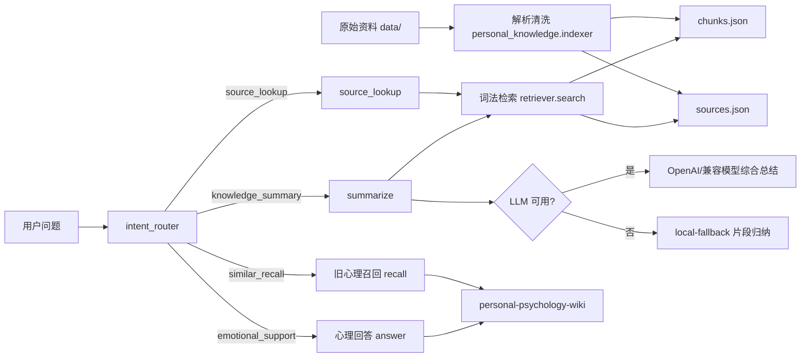

# 个人知识系统架构

## 目标

这套系统从单一心理助手升级为多领域个人知识系统，目标是：

- 存得住：长期保存个人记录、外部文章、投资复盘、心理经验。
- 找得到：能定位原始资料、路径和片段位置。
- 想得清：能综合多篇内容，提炼观点、原则、教训。
- 用得上：能服务职业、投资、心理、生活决策等具体场景。

## 当前实现图



## 数据分层

### 原始资料层

原始资料仍然保存在 `data/` 下，包括：

- `data/thinking-notes/`：个人随笔和生活记录。
- `data/*.md`：根目录下的主题笔记。
- `data/**/*.html`：文章正文。
- `data/**/*.docx`、`data/**/*.txt`：文档和文本记录。

当前 v1 暂不解析 PDF 和图片。

### 通用知识索引层

通用索引输出到：

```text
data/knowledge-index/
  sources.json
  chunks.json
  README.md
```

`sources.json` 保存资料级元数据：

```json
{
  "source_id": "...",
  "title": "...",
  "path": "...",
  "kind": "md|txt|docx|html",
  "domain": "career|investment|psychology|tech|life",
  "source_type": "original|reflection|external",
  "author": "self|external",
  "created_at": "2026-03-25",
  "tags": ["career", "original"]
}
```

`chunks.json` 保存可检索片段：

```json
{
  "chunk_id": "...",
  "source_id": "...",
  "title": "...",
  "path": "...",
  "domain": "career",
  "source_type": "original",
  "position": 3,
  "text": "...",
  "tags": ["career", "original"]
}
```

## 意图路由

`assistant.cmd` 现在是总入口：

```text
assistant.cmd
  -> personal_psych_assistant.core.assistant
  -> intent_router.classify_intent
```

当前意图：

- `source_lookup`：找原文、出处、哪篇文章提到过。
- `knowledge_summary`：总结过去记录中的观点、看法、原则。
- `similar_recall`：召回相似经历。
- `emotional_support`：当前焦虑、难受、失控时的心理支持。
- `general_answer`：兜底，暂时走知识总结链路。

关键边界：

- `knowledge_summary` 和 `source_lookup` 不经过焦虑 profile。
- `emotional_support` 和 `similar_recall` 继续使用旧心理 wiki。
- 知识总结必须尽量带来源，不能只输出无依据结论。

## 命令映射

```powershell
.\knowledge_index.cmd
```

重建通用知识索引。

```powershell
.\source.cmd --rebuild "我在哪篇文章里提到过失业"
```

定位原文和片段。

```powershell
.\summarize.cmd --rebuild "总结我过去关于失业的观点"
```

检索相关片段，并优先调用大模型综合总结。

```powershell
.\summarize.cmd --no-llm "总结我过去关于失业的观点"
```

只使用本地检索和兜底片段归纳。

```powershell
.\assistant.cmd --rebuild "我之前的记录中对于应对失业有哪些观点和看法，请帮我总结后列出来"
```

统一入口，自动识别为 `knowledge_summary`。

## 当前模块

```text
personal_knowledge/
  indexer.py      原始资料解析、source/chunk 索引构建
  retriever.py    本地词法检索
  synthesizer.py  原文定位、知识总结、LLM/本地兜底
  cli.py          index/source/summarize 命令入口
  schema.py       SourceRecord/ChunkRecord/SearchResult
  text.py         分句、term 提取、压缩文本
```

旧心理助手保留在：

```text
personal_psych_assistant/
  core/answer.py
  core/recall.py
  knowledge/compiler.py
```

## 后续扩展点

v2 建议补：

- embedding 语义检索。
- BM25 正式全文索引。
- rerank 重排。
- PDF 正文解析。
- claims/principles/lessons/actions 结构化提炼。
- 反馈机制：准确、过时、不重要、领域修正。
- 投资复盘、决策辅助等领域专用 prompt。

